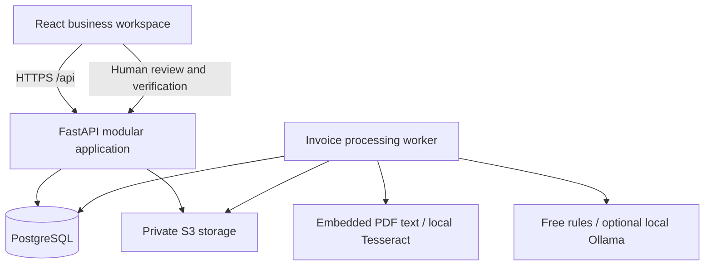

# Architecture and extension guide

HAJJAH SITI GLOBAL Business Management is a single-business modular monolith. React handles navigation, forms and display. FastAPI owns access control, validation and workflows. PostgreSQL owns records and relationships. Documents live in private object storage, while a separate worker claims durable processing jobs from the database. The API and worker use the same Python application package; they are separate processes, not microservices.

The selected free deployment runs the frontend, API and a single job consumer together in one Render web service. PostgreSQL and private documents live on Supabase Free. The same worker function can still run in a separate process for local development. Free hosting may sleep; queued jobs remain in PostgreSQL. No external OCR/AI API is required.

## Project map

| Location | Responsibility |
|---|---|
| `frontend/src/main.tsx` | Authenticated application shell, routing and permission-aware navigation |
| `frontend/src/ui.tsx`, `style.css` | Shared controls, design tokens, tables, dialogs and state patterns |
| `frontend/src/pages/Bills.tsx` | Invoice list, upload, original-document comparison and verification |
| `frontend/src/pages/Modules.tsx` | Supplier, payment, people, reporting and administration surfaces |
| `backend/app/auth.py`, `security.py` | Password hashing, database-backed sessions, CSRF, authorization and audit helpers |
| `backend/app/purchasing.py`, `services.py` | Suppliers, invoices, allocations, expected invoices and financial invariants |
| `backend/app/people.py` | Protected employee profiles, payroll snapshots and payslip generation |
| `backend/app/operations.py` | Dashboard, reports, private documents, users, settings and audit read APIs |
| `backend/app/processing.py`, `worker.py` | Replaceable OCR/extraction adapters and durable job processing |
| `backend/app/models.py`, `schemas.py` | Relational model and validated request contracts |
| `backend/migrations` | Versioned schema changes and audit mutation protection |

## Core relationships

Users belong to one role. Role permission lists control backend dependency checks and the navigation returned to the browser. Staff invoice access is additionally constrained by `submitted_by`; knowing a record ID does not grant access. Employee and payroll access is owner-only. There is no employee self-service login in this release.

Suppliers have many bills. Bills have an optional original document and many line items. Payments allocate amounts to one or more verified bills belonging to the same supplier. Allocations carry the money; payment totals are calculated from their allocations. Voided payments retain their allocations and reason, but are excluded from financial balances. Bills and payroll store exact decimal amounts, never binary floating point.

Official supplier liability is the sum of verified/approved bill totals minus active payment allocations. Draft, rejected and processing invoices do not become liabilities. A partially paid overdue invoice displays Overdue, with paid and remaining amounts still visible. The first release supports MYR only so totals never accidentally combine currencies.

Payroll snapshots the employee name, employee code and basic salary. Later salary edits do not rewrite historical payroll. Gross and net amounts are derived from the stored components. One payroll record per employee per month is enforced by a unique constraint. Payslips are generated from those records on demand.

Expected invoices require evidence: a delivery reference, supplier confirmation or agreed schedule. An unresolved expectation becomes potentially missing when its expected date passes. Resolution requires a matching verified bill; exemption requires an explanation. The system never infers lost documents merely from gaps in invoice numbering.

## Transactions and concurrency

Each API request uses a transaction and rolls back on error. Audit events are written inside the same transaction as their changes. PostgreSQL row locks serialize invoice verification, payment allocations and voiding. Payments lock bills in stable ID order. Requests carry an idempotency key so retries do not record a second payment. Invoice edits and verification use an explicit version counter to reject stale reviews.

Verified invoices can be corrected by an owner while unpaid; corrections return them to review and remove the prior verification marker, while audit history preserves the previous event. Paid invoices are locked. Void an erroneous payment with a reason before correcting the invoice. Actual supplier refunds and credit-note accounting are future workflows, not silently modelled as negative payments.

Processing jobs are queued transactionally with the document record. Workers claim jobs with `FOR UPDATE SKIP LOCKED`, release the transaction before remote work, and reclaim jobs abandoned for ten minutes. Attempt fencing stops an old worker from overwriting a newer attempt. All extraction output is validated and marked for review. No provider can verify a record.

Audit entries have no update/delete API. A database trigger rejects ordinary UPDATE and DELETE operations on the audit table. A database administrator with DDL privileges can still remove triggers, so use a restricted runtime database role and separate migration credentials. This is an operational audit trail, not a cryptographically tamper-proof ledger.

## Adding a module

1. Define the domain and permissions before the UI. Add model classes with foreign keys and indexes. Generate and inspect an Alembic migration.
2. Keep business decisions in backend service functions. Reuse request validation, `require()`, transaction scope and `audit()`.
3. Add a dedicated API router and register it in `main.py`. Use bounded pagination and server-side filters.
4. Add route components using the existing page header, forms, dialogs, tables and status styles. Add a navigation item with the matching permission.
5. Extend explicit role permission lists and update existing role rows in a migration or controlled administration command. A source-code list change alone does not update stored roles.
6. Test allowed and forbidden access, business calculations, concurrency and audit effects.

For purchase orders, create orders and order lines, then receipts and receipt lines. Add an optional invoice-line matching table pointing to receipt/order lines. Do not overload invoice numbers as order IDs or add inventory logic to the Bill model. Stock movements should become their own append-oriented domain. Sales/customer accounting should have separate receivable records, using shared documents and audit infrastructure where appropriate.

## Deliberate first-release boundaries

This is one business, with two fixed permission profiles and per-user role assignment. It is not a multi-tenant SaaS service. Multi-branch accounting, custom permission designers, bank reconciliation, statutory payroll computation, credit notes, automated recurring expectations, employee self-service and notification delivery by email are not implemented. Operational alerts and the review queue are derived from current records, avoiding a second stale source of status. Reports are operational reports, not a general ledger.

## Framework references

Session cookies follow [FastAPI's response-cookie API](https://fastapi.tiangolo.com/advanced/response-cookies/). Transaction and locking behavior uses [SQLAlchemy's session API](https://docs.sqlalchemy.org/en/20/orm/session_api.html). Provider-specific behavior is isolated so it can be replaced without rewriting the rest of the system.
